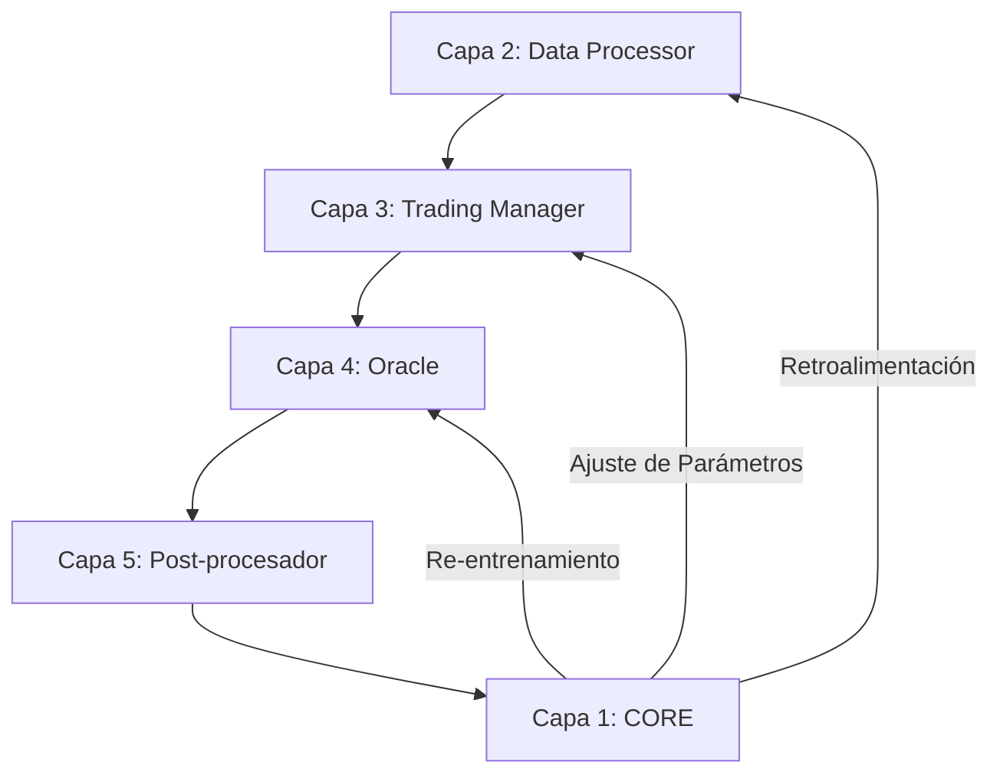

# Aipha v0.0.2 - Arquitectura del Sistema Autónomo

> **Documento Consolidado**: Este archivo unifica toda la documentación de arquitectura del proyecto para servir como referencia e inspiración para el desarrollo futuro.

---

## 🧬 Filosofía: El Bucle Cerrado

Aipha v0.0.2 no es un bot de trading convencional. Es un **organismo digital** diseñado para evolucionar.

### Del Sistema Lineal al Bucle Cerrado

**ANTES (v0.0.1 - Lineal):**
```
Datos → Análisis → Ejecución → [OLVIDO]
```

**DESPUÉS (v0.0.2 - Cerrado):**
```
Datos → Análisis → Ejecución → MEMORIA → APRENDIZAJE → MEJORA → [NUEVO CICLO]
```



---

## 🏛️ Arquitectura de Capas

### Capa 1: Core (Autonomous Intelligence)
**Componentes Clave:**
| Archivo | Función |
|---------|---------|
| `context_sentinel.py` | Memoria persistente (JSON/JSONL) |
| `orchestrator.py` | Orquestador del ciclo de automejora |
| `change_proposer.py` | Generador de propuestas (heurísticas o LLM) |
| `change_evaluator.py` | Evaluador con scoring ponderado |
| `atomic_update_system.py` | Protocolo atómico de 5 pasos |
| `llm_proposer.py` | Integración con Qwen 2.5 Coder |

### Capa 2: Data Processor
- Descarga datos de Binance Vision
- Almacena en DuckDB para análisis

### Capa 3: Trading Manager
- Detectores de señales (velas clave)
- Triple Barrier Method con ATR dinámico

### Capa 4: Oracle
- Machine Learning (Random Forest)
- Filtrado de señales de baja probabilidad

### Capa 5: Data Postprocessor
- Análisis post-mortem de trades
- Ajuste adaptativo de barreras

---

## 🔄 El Ciclo de Automejora (5 Fases)

El sistema ejecuta este ciclo automáticamente cada cierto período:

### Fase 1: Recolección (ContextSentinel)
- Lee métricas: Win Rate, Drawdown, Total Trades
- Consulta `current_state.json`

### Fase 2: Análisis (ChangeProposer)
Reglas heurísticas implementadas:
| Condición | Acción |
|-----------|--------|
| `total_trades == 0` | "Loosen Entry" (reducir ATR period) |
| `win_rate < 0.4` | "Tighten Risk" (reducir SL factor) |
| `win_rate > 0.6` | "Stabilize" (aumentar TP factor) |

**Fase 7**: Hysteresis y límites de parámetros.
**Fase 8**: Integración LLM para razonamiento avanzado.

### Fase 3: Evaluación (ProposalEvaluator)
Scoring ponderado (0.0 - 1.0):
- **Impacto**: 30%
- **Dificultad**: 20%
- **Riesgo**: 30%
- **Complejidad**: 20%

> Solo propuestas con **score ≥ 0.70** son aprobadas.

### Fase 4: Ejecución (AtomicUpdateSystem)
El Protocolo Atómico de 5 Pasos:
1. **Backup**: Crear `.bak` del archivo objetivo
2. **Diff**: Aplicar cambio línea por línea
3. **Test**: Ejecutar `pytest` en el componente
4. **Commit**: Si pasa, eliminar backup
5. **Rollback**: Si falla, restaurar backup

### Fase 5: Registro
- Guardar resultado en `action_history.jsonl`
- Actualizar `current_state.json`

---

## 🧪 Sistema de Tests

```bash
# Tests del core
pytest tests/test_context_sentinel.py tests/test_orchestrator.py -v

# Tests de cambios
pytest tests/test_change_proposer.py tests/test_atomic_update.py -v

# Suite completa
pytest tests/ -v
```

---

## 🧠 Integración LLM (Fase 8)

El sistema puede usar un LLM para generar propuestas avanzadas:

```python
# Configuración en core/llm_proposer.py
LLM_CONFIG = {
    "model": "Qwen/Qwen2.5-Coder-32B-Instruct",
    "api_base": "https://router.huggingface.co/v1",
    "api_key": os.environ.get("HF_API_KEY")
}
```

**Prompt Template**: El LLM recibe métricas + código actual y responde con JSON estructurado.

**Fallback**: Si el LLM falla, el sistema usa heurísticas automáticamente.

---

## 🗺️ Roadmap: Próximos Pasos

### Fase 9: Multi-Asset
- Extender el sistema a múltiples pares de trading
- Pipeline paralelo de datos

### Fase 10: Backtesting Continuo
- Validar cambios propuestos contra datos históricos antes de aplicar

### Fase 11: Ejecución Real
- Integrar con exchanges vía API
- Gestión de órdenes en tiempo real

### Fase 12: Dashboard
- Interfaz web para monitorear el sistema
- Visualización del historial de cambios

---

## 📊 Comparación: Antes vs Después

| Aspecto | v0.0.1 (Lineal) | v0.0.2 (Cerrado) |
|---------|-----------------|------------------|
| Memoria | ❌ Ninguna | ✅ Persistente |
| Aprendizaje | ❌ Manual | ✅ Automático |
| Cambios | ❌ Requiere dev | ✅ Autónomos |
| Degradación | ❌ No detectada | ✅ Auto-revertida |
| LLM | ❌ N/A | ✅ Qwen 2.5 Coder |

---

## 📁 Estructura del Proyecto (Post-Limpieza)

```
Aipha_0.0.2/
├── core/                    # Capa 1: Autonomous Intelligence
│   ├── orchestrator.py
│   ├── context_sentinel.py
│   ├── change_proposer.py
│   ├── change_evaluator.py
│   ├── atomic_update_system.py
│   ├── llm_proposer.py
│   └── ...
├── trading_manager/         # Capa 3: Estrategia
│   └── building_blocks/
│       └── labelers/
│           └── potential_capture_engine.py
├── oracle/                  # Capa 4: ML
├── data_processor/          # Capa 2: Datos
├── simulation/              # Generador de mercado sintético
├── tests/                   # Suite de pruebas
├── memory/                  # Almacenamiento persistente
├── doc/                     # Documentación (legacy)
└── life_cycle.py            # Simulación del ciclo de vida
```

---

*Aipha v0.0.2 - Un sistema que no solo opera, sino que evoluciona.*
