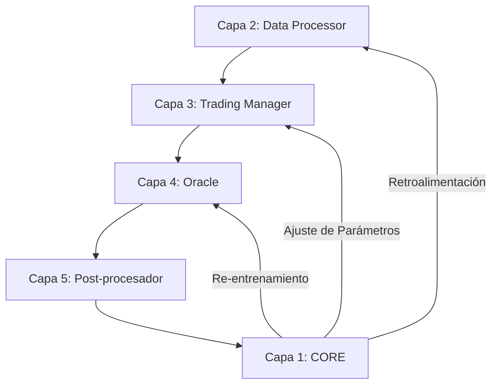

# Aipha v0.0.2 - Arquitectura del Sistema Autónomo

> **Documento Consolidado**: Este archivo unifica toda---

## 🎛️ CLI y Herramientas (v0.0.2+)

### Interface de Línea de Comandos (aiphalab/cli.py)

La v0.0.2 incluye una interfaz CLI completa para interactuar con el sistema:

**Comandos Principales:**

| Comando | Descripción |
|---------|-------------|
| `aipha status` | Ver estado actual del sistema |
| `aipha cycle run` | Ejecutar un ciclo de automejora |
| `aipha cycle watch` | Ejecutar ciclos automáticos |
| `aipha config view` | Ver configuración actual |
| `aipha config validate` | Validar parámetros de configuración |
| `aipha config suggest <param>` | Obtener sugerencias para un parámetro |
| `aipha dashboard` | Dashboard en tiempo real |
| `aipha history --limit N` | Ver historial de acciones |

**Opciones Globales:**

```bash
# Modo Dry-Run: Simula ejecución sin persistencia
aipha --dry-run cycle run
```

### Modo Dry-Run Global

Añadido en v0.0.2, permite simular la ejecución de cualquier comando sin persistir cambios:

```python
# core/orchestrator.py - Refactorizado
class CentralOrchestrator:
    def __init__(self, storage_root: Path, use_llm: bool = False, dry_run: bool = False):
        self.dry_run = dry_run
        
    def run_improvement_cycle(self, lookback_days: int = 7) -> Dict[str, Any]:
        if self.dry_run:
            # Solo simula cambios, no persiste
            logger.info("[DRY-RUN MODE] Cambios simulados sin persistencia")
```

**Casos de uso:**
- Testing seguro de cambios propuestos
- Validación de configuración antes de aplicar
- Simulación de ciclos sin modificar el sistema

### Validadores de Configuración (core/config_validators.py)

Sistema robusto de validación de parámetros usando Pydantic:

```python
from core.config_validators import ConfigValidator

# Validar configuración completa
is_valid, errors = ConfigValidator.validate_full_config(config_dict)

# Validar parámetro específico
is_valid, msg = ConfigValidator.validate_parameter("Trading", "tp_factor", 2.5)

# Obtener reporte detallado
report = ConfigValidator.get_validation_report(config_dict)
```

**Rangos de Validación:**

| Parámetro | Rango | Descripción |
|-----------|-------|-------------|
| `atr_period` | 5-50 | Período del promedio verdadero |
| `tp_factor` | 0.5-5.0 | Multiplicador de TP (> sl_factor) |
| `sl_factor` | 0.1-3.0 | Multiplicador de SL |
| `confidence_threshold` | 0.5-0.99 | Umbral del Oracle |
| `n_estimators` | 10-1000 | Estimadores del modelo ML |

### Dashboard en Tiempo Real (aiphalab/dashboard.py)

Interfaz interactiva con rico para monitoreo en vivo:

```bash
aipha dashboard --interval 2  # Actualiza cada 2 segundos
```

**Paneles Mostrados:**
- 📊 Métricas del sistema (última propuesta, cambios aplicados)
- 📋 Propuestas recientes
- 📜 Historial de acciones
- ⚙️ Información del sistema

---

## 🧪 Sistema de Tests

```bash
# Tests del core
pytest tests/test_context_sentinel.py tests/test_orchestrator.py -v

# Tests de cambios
pytest tests/test_change_proposer.py tests/test_atomic_update.py -v

# Suite completa
pytest tests/ -v
```

**Tests del CLI (v0.0.2+):**
- Dry-run mode simula sin persistencia
- Config validate verifica rangos
- Dashboard imports correctamente
- Todos los comandos compilablesión de arquitectura del proyecto para servir como referencia e inspiración para el desarrollo futuro.

---

## 🧬 Filosofía: El Bucle Cerrado

Aipha v0.0.2 no es un bot de trading convencional. Es un **organismo digital** diseñado para evolucionar.

### Del Sistema Lineal al Bucle Cerrado

**ANTES (v0.0.1 - Lineal):**
```
Datos → Análisis → Ejecución → [OLVIDO]
```

**DESPUÉS (v0.0.2 - Cerrado):**
```
Datos → Análisis → Ejecución → MEMORIA → APRENDIZAJE → MEJORA → [NUEVO CICLO]
```



---

## 🏛️ Arquitectura de Capas

### Capa 1: Core (Autonomous Intelligence)
**Componentes Clave:**
| Archivo | Función |
|---------|---------|
| `context_sentinel.py` | Memoria persistente (JSON/JSONL) |
| `orchestrator.py` | Orquestador del ciclo de automejora |
| `change_proposer.py` | Generador de propuestas (heurísticas o LLM) |
| `change_evaluator.py` | Evaluador con scoring ponderado |
| `atomic_update_system.py` | Protocolo atómico de 5 pasos |
| `llm_proposer.py` | Integración con Qwen 2.5 Coder |

### Capa 2: Data Processor
- Descarga datos de Binance Vision
- Almacena en DuckDB para análisis

### Capa 3: Trading Manager
- Detectores de señales (velas clave)
- Triple Barrier Method con ATR dinámico

### Capa 4: Oracle
- Machine Learning (Random Forest)
- Filtrado de señales de baja probabilidad

### Capa 5: Data Postprocessor
- Análisis post-mortem de trades
- Ajuste adaptativo de barreras

---

## 🔄 El Ciclo de Automejora (5 Fases)

El sistema ejecuta este ciclo automáticamente cada cierto período:

### Fase 1: Recolección (ContextSentinel)
- Lee métricas: Win Rate, Drawdown, Total Trades
- Consulta `current_state.json`

### Fase 2: Análisis (ChangeProposer)
Reglas heurísticas implementadas:
| Condición | Acción |
|-----------|--------|
| `total_trades == 0` | "Loosen Entry" (reducir ATR period) |
| `win_rate < 0.4` | "Tighten Risk" (reducir SL factor) |
| `win_rate > 0.6` | "Stabilize" (aumentar TP factor) |

**Fase 7**: Hysteresis y límites de parámetros.
**Fase 8**: Integración LLM para razonamiento avanzado.

### Fase 3: Evaluación (ProposalEvaluator)
Scoring ponderado (0.0 - 1.0):
- **Impacto**: 30%
- **Dificultad**: 20%
- **Riesgo**: 30%
- **Complejidad**: 20%

> Solo propuestas con **score ≥ 0.70** son aprobadas.

### Fase 4: Ejecución (AtomicUpdateSystem)
El Protocolo Atómico de 5 Pasos:
1. **Backup**: Crear `.bak` del archivo objetivo
2. **Diff**: Aplicar cambio línea por línea
3. **Test**: Ejecutar `pytest` en el componente
4. **Commit**: Si pasa, eliminar backup
5. **Rollback**: Si falla, restaurar backup

### Fase 5: Registro
- Guardar resultado en `action_history.jsonl`
- Actualizar `current_state.json`

---

## 🧪 Sistema de Tests

```bash
# Tests del core
pytest tests/test_context_sentinel.py tests/test_orchestrator.py -v

# Tests de cambios
pytest tests/test_change_proposer.py tests/test_atomic_update.py -v

# Suite completa
pytest tests/ -v
```

---

## 🧠 Integración LLM (Fase 8)

El sistema puede usar un LLM para generar propuestas avanzadas:

```python
# Configuración en core/llm_proposer.py
LLM_CONFIG = {
    "model": "Qwen/Qwen2.5-Coder-32B-Instruct",
    "api_base": "https://router.huggingface.co/v1",
    "api_key": os.environ.get("HF_API_KEY")
}
```

**Prompt Template**: El LLM recibe métricas + código actual y responde con JSON estructurado.

**Fallback**: Si el LLM falla, el sistema usa heurísticas automáticamente.

---

## 🗺️ Roadmap: Próximos Pasos

### Fase 9: Multi-Asset
- Extender el sistema a múltiples pares de trading
- Pipeline paralelo de datos

### Fase 10: Backtesting Continuo
- Validar cambios propuestos contra datos históricos antes de aplicar

### Fase 11: Ejecución Real
- Integrar con exchanges vía API
- Gestión de órdenes en tiempo real

### Fase 12: Dashboard
- Interfaz web para monitorear el sistema
- Visualización del historial de cambios

---

## 📊 Comparación: Antes vs Después

| Aspecto | v0.0.1 (Lineal) | v0.0.2 (Cerrado) | v0.0.2+ (Con CLI) |
|---------|-----------------|------------------|-------------------|
| Memoria | ❌ Ninguna | ✅ Persistente | ✅ Persistente |
| Aprendizaje | ❌ Manual | ✅ Automático | ✅ Automático |
| Cambios | ❌ Requiere dev | ✅ Autónomos | ✅ Autónomos |
| Degradación | ❌ No detectada | ✅ Auto-revertida | ✅ Auto-revertida |
| LLM | ❌ N/A | ✅ Qwen 2.5 Coder | ✅ Qwen 2.5 Coder |
| **CLI** | ❌ N/A | ❌ N/A | ✅ Completa |
| **Dry-Run** | ❌ N/A | ❌ N/A | ✅ Global |
| **Validación** | ❌ N/A | ❌ Manual | ✅ Automática |
| **Dashboard** | ❌ N/A | ❌ N/A | ✅ Tiempo real |

---

## 📁 Estructura del Proyecto (Post-Limpieza v0.0.2+)

```
Aipha_0.0.2/
├── core/                    # Capa 1: Autonomous Intelligence
│   ├── orchestrator.py          (Refactorizado con dry_run)
│   ├── context_sentinel.py
│   ├── change_proposer.py
│   ├── change_evaluator.py
│   ├── atomic_update_system.py
│   ├── config_managers.py
│   ├── config_validators.py     (✨ NUEVO - v0.0.2+)
│   ├── llm_proposer.py
│   └── ...
├── aiphalab/                # Capa 1: Interface y Herramientas
│   ├── cli.py                   (✨ Actualizado - v0.0.2+)
│   ├── dashboard.py             (✨ NUEVO - v0.0.2+)
│   ├── assistant.py
│   ├── formatters.py
│   └── __init__.py
├── trading_manager/         # Capa 3: Estrategia
│   └── building_blocks/
│       └── labelers/
│           └── potential_capture_engine.py
├── oracle/                  # Capa 4: ML
├── data_processor/          # Capa 2: Datos
├── simulation/              # Generador de mercado sintético
├── tests/                   # Suite de pruebas
├── memory/                  # Almacenamiento persistente
├── doc/                     # Documentación (legacy)
└── life_cycle.py            # Simulación del ciclo de vida
```

**Archivos Nuevos en v0.0.2+:**
- `core/config_validators.py` - Validación Pydantic de configuración
- `aiphalab/dashboard.py` - Dashboard en tiempo real con rich
- `aiphalab/cli.py` (actualizado) - Soporte para dry-run y nuevos comandos

---

*Aipha v0.0.2 - Un sistema que no solo opera, sino que evoluciona.*
