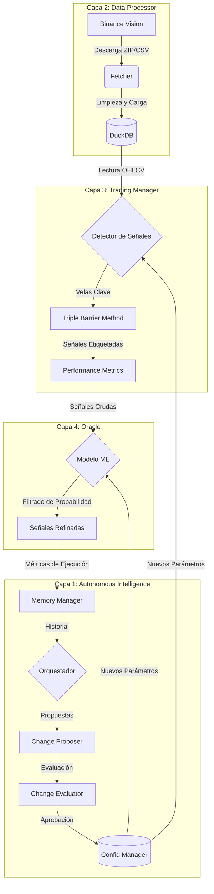

# Guía de Flujo de Aipha v0.0.2

Esta guía describe el ciclo de vida de la información dentro del sistema Aipha, desde la captura de datos crudos hasta la toma de decisiones autónoma y la automejora.

## 🔄 Resumen del Flujo End-to-End

El sistema opera como una tubería (pipeline) secuencial donde cada capa añade valor y refinamiento a la anterior.



---

## 📂 Detalle por Capas

### 1. Adquisición y Almacenamiento (Capa 2)
**Script**: `data_processor/acquire_data.py`
- **Entrada**: Plantillas de solicitud (ej. BTC 1h).
- **Proceso**: El `Fetcher` descarga datos históricos, los descomprime y los inserta en **DuckDB**.
- **Resultado**: Una tabla analítica (`btc_1h_data`) lista para ser consultada por las capas superiores.

### 2. Detección y Etiquetado (Capa 3)
**Script**: `trading_manager/strategies/proof_strategy.py`
- **Entrada**: Datos OHLCV desde DuckDB.
- **Proceso**:
    - Identifica "Velas Clave" (ej. volumen inusual o patrones específicos).
    - Aplica el **Triple Barrier Method**: Define un objetivo de ganancia (TP) y uno de pérdida (SL) basados en la volatilidad actual (**ATR**).
- **Resultado**: Un conjunto de señales con etiquetas: `1` (Éxito), `-1` (Fallo), `0` (Neutral/Tiempo agotado).

### 3. Refinamiento Inteligente (Capa 4)
**Script**: `oracle/strategies/proof_strategy_v2.py`
- **Entrada**: Señales generadas por la Capa 3.
- **Proceso**:
    - El **Oráculo** (un modelo Random Forest) analiza el contexto de cada señal.
    - Descarta aquellas con baja probabilidad de éxito según patrones históricos aprendidos.
- **Resultado**: Una reducción del número de operaciones, pero con una mayor calidad esperada (Win Rate optimizado).

### 4. Ciclo de Automejora (Capa 1)
**Script**: `python3 -m core.orchestrator`
- **Entrada**: Métricas de rendimiento de todas las capas anteriores almacenadas en el `MemoryManager`.
- **Proceso**:
    1. **Recolección**: Lee el Win Rate y otros KPIs.
    2. **Propuesta**: Si el rendimiento es subóptimo, propone cambios (ej. "Aumentar el factor TP de 2.0 a 2.2").
    3. **Evaluación**: Simula o evalúa el riesgo del cambio.
    4. **Aplicación**: Actualiza `aipha_config.json` y crea un backup de seguridad.
- **Resultado**: El sistema se ajusta solo para la próxima ejecución.

---

## 🚀 Cómo empezar a entender el código

Para ver este flujo en acción, se recomienda seguir este orden:

1.  **Ver el Reporte de Prueba**: Abre `full_system_test_report.md` para ver los números reales de la última ejecución.
2.  **Ejecutar el Dashboard**: 
    ```bash
    python3 -m core.dashboard
    ```
    Esto te dará una visión rápida del estado actual del sistema y las últimas acciones tomadas.
3.  **Explorar la Configuración**: Revisa `memory/aipha_config.json` para ver qué parámetros están controlando el comportamiento de las estrategias.

---
*Aipha v0.0.2 - Hacia la autonomía total.*
