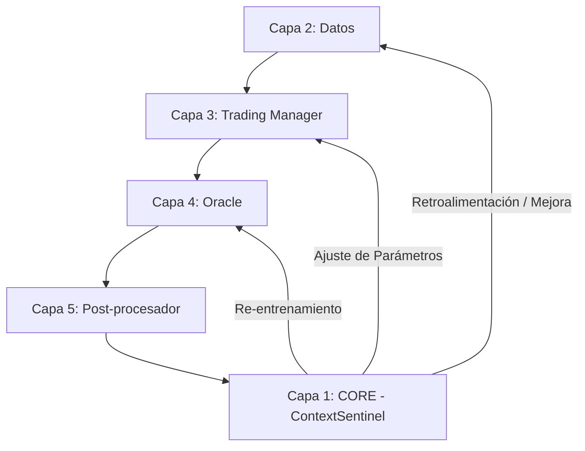

# Aipha v0.0.2 - Guía Maestra de Estudio: FASE 1 (ContextSentinel)

Bienvenido al punto de partida de **Aipha v0.0.2**. Este documento no es solo una guía técnica, es el mapa para comprender cómo Aipha evoluciona de ser un simple bot de trading a un **Sistema de Inteligencia Autónoma**.

---

## 1. 🌐 El Cambio de Paradigma: De Lineal a Bucle Cerrado

En los sistemas tradicionales (v0.0.1), el flujo es lineal:
`Datos → Análisis → Ejecución → [FIN]`

En **Aipha v0.0.2**, introducimos la **Capa 1 (Core)** para cerrar el bucle:
`Datos → Análisis → Ejecución → MEMORIA → APRENDIZAJE → MEJORA → [SIGUIENTE CICLO]`

### El Bucle Cerrado (Closed Loop)
El objetivo de la Fase 1 es construir el **ContextSentinel**, el guardián de la memoria que permite que este bucle exista. Sin memoria, no hay aprendizaje; sin aprendizaje, no hay autonomía.



---

## 2. 🛡️ El Protocolo Atómico (CriticalMemoryRules)

Para que un sistema se mejore a sí mismo de forma segura, necesita reglas estrictas. Aipha utiliza un **Protocolo Atómico de 5 Pasos** para asegurar que ningún cambio rompa el sistema:

1.  **Backup**: Antes de tocar nada, se guarda el estado actual.
2.  **Diff**: Se genera la propuesta de cambio exacta.
3.  **Test**: Se ejecutan pruebas automáticas sobre el cambio propuesto.
4.  **Commit**: Si los tests pasan, el cambio se consolida.
5.  **Rollback**: Si algo falla en cualquier punto, el sistema vuelve al backup instantáneamente.

*Nota: En la Fase 1, `ContextSentinel` proporciona la infraestructura para registrar estos pasos.*

---

## 3. 🧠 Profundizando en ContextSentinel

`ContextSentinel` no es solo una base de datos; es un sistema de persistencia diseñado para la resiliencia.

### 📁 Arquitectura de Almacenamiento (`/memory/`)

| Archivo | Formato | Naturaleza | Propósito |
| :--- | :--- | :--- | :--- |
| `current_state.json` | JSON | **Mutable** | Almacena la "fotografía" actual del sistema: umbrales, versiones de modelos, y variables de entorno. |
| `action_history.jsonl` | JSONL | **Append-Only** | El "diario" de Aipha. Cada decisión, error o éxito se escribe al final. Es inmutable por diseño. |

> [!IMPORTANT]
> Usamos **JSONL** (JSON Lines) para el historial porque permite escribir nuevas acciones sin cargar todo el archivo en memoria, lo que hace al sistema extremadamente eficiente y resistente a corrupciones de archivo (si una línea se rompe, las demás siguen siendo válidas).

### 🛠️ API y Complejidad Interna

#### Gestión de Estado (`add_memory` / `query_memory`)
El estado se maneja como un diccionario clave-valor. Cada vez que se actualiza el estado, `ContextSentinel` registra automáticamente una acción de tipo `MEMORY_ADD` en el historial, creando una trazabilidad total.

#### Registro de Acciones (`add_action`)
Cada entrada en el historial contiene:
- `timestamp`: Momento exacto en UTC.
- `agent`: Quién realizó la acción (ej. `ChangeProposer`).
- `action_type`: Qué sucedió (ej. `PROPOSAL_APPROVED`).
- `details`: Metadatos específicos del evento.

---

## 4. 🧪 Resiliencia y Manejo de Errores

Aipha está diseñada para sobrevivir en entornos hostiles. `ContextSentinel` incluye:
- **Auto-recuperación**: Si `current_state.json` está corrupto o vacío, el sistema inicializa uno nuevo por defecto en lugar de detenerse.
- **Validación de Líneas**: Al leer el historial JSONL, el sistema ignora líneas corruptas individualmente, preservando el resto de la historia.
- **Aislamiento de Almacenamiento**: La raíz de memoria es configurable, permitiendo entornos de prueba aislados de la producción.

---

## 5. 📈 Verificación de la Fase 1

La complejidad de la Fase 1 se valida mediante 19 tests críticos:
- `test_two_executions_scenario`: Simula dos arranques del sistema para confirmar que la memoria sobrevive al reinicio.
- `test_corrupted_json_handling`: Verifica que el sistema no "muera" si los archivos de disco se dañan.
- `test_statistics`: Comprueba que el sistema puede auto-analizar su propia actividad.

**Ejecución de Verificación:**
```bash
pytest tests/test_context_sentinel.py -v
```

---

## 🚀 Hacia la Fase 2: El Propositor de Cambios

Con la Fase 1 completada, Aipha ya tiene **Memoria**. En la Fase 2, implementaremos el **Cerebro Analítico** (`ChangeProposer`), que leerá esta memoria para detectar cuándo el sistema debe cambiar sus propios parámetros para ganar más dinero o reducir el riesgo.

---
*Aipha v0.0.2 - Construyendo el futuro del trading autónomo.*
