# Aipha v0.0.2 - Guía de Estudio: FASE 3 (CodecraftSage)

La Fase 3 es el corazón de la autonomía. Aquí es donde Aipha deja de ser un sistema pasivo y adquiere la capacidad de **modificar su propio código** de forma segura.

---

## 🛡️ El Protocolo Atómico (AtomicUpdateSystem)

Para evitar que el sistema se autodestruya con un cambio erróneo, hemos implementado un protocolo estricto de 5 pasos. Si cualquiera de estos pasos falla, el sistema vuelve al estado anterior.

### Los 5 Pasos de la Seguridad:

1.  **Backup**: Antes de tocar nada, se crea una copia de seguridad (`.py.bak`).
2.  **Diff**: Se aplican los cambios propuestos (línea por línea).
3.  **Test**: Se ejecutan las pruebas unitarias asociadas al componente modificado.
4.  **Commit**: Si (y solo si) los tests pasan, se borra el backup y se confirma el cambio.
5.  **Rollback**: Si los tests fallan o hay un error, se restaura el backup inmediatamente.

---

## 🛠️ Integración en el Ciclo

El `AtomicUpdateSystem` se ha integrado en el `CentralOrchestrator`. Ahora, cuando una propuesta es aprobada por el `ProposalEvaluator` (Fase 2), pasa automáticamente al sistema atómico para su ejecución.

```mermaid
graph LR
    A[Propuesta Aprobada] --> B{AtomicUpdateSystem}
    B --> C[1. Backup]
    C --> D[2. Apply Diff]
    D --> E[3. Run Tests]
    E -- Pass --> F[4. Commit]
    E -- Fail --> G[5. Rollback]
    F --> H[Éxito]
    G --> I[Fallo Seguro]
```



---

## 🧪 Verificación de la Fase 3

La seguridad de este sistema se ha validado con pruebas rigurosas:

- **Test de Éxito**: Verifica que un cambio válido se aplica y el backup desaparece.
- **Test de Rollback**: Simula un cambio que rompe los tests y verifica que el archivo original se restaura intacto.
- **Test de Archivo Perdido**: Manejo de errores si el archivo objetivo no existe.

**Ejecutar Pruebas:**
```bash
pytest tests/test_atomic_update.py -v
```

**Cobertura**: 99% del código del sistema atómico está cubierto por tests.

---

## 🚀 Siguiente Paso: FASE 4 (Evolución)

Con las Fases 1, 2 y 3 completadas, Aipha tiene:
1.  **Memoria** (ContextSentinel)
2.  **Pensamiento** (ChangeProposer/Evaluator)
3.  **Manos** (AtomicUpdateSystem)

El sistema está listo para operar en **Bucle Cerrado**.

---
*Aipha v0.0.2 - Autonomía segura y verificada.*
